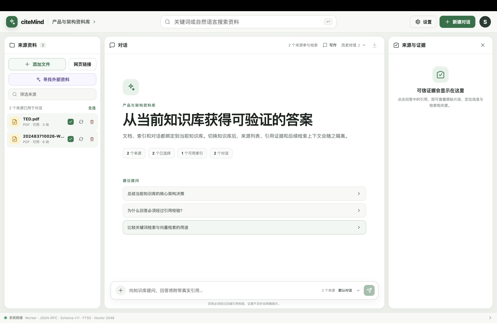

<h1 align="center">CiteMind</h1>

<p align="center">
  
  
  
  
</p>

> citeMind 是一个桌面端个人知识库助手。首版面向 macOS Apple Silicon，用户使用自己的火山方舟 Ark API Key，将 PDF、DOCX、图片和网页导入为可检索、可追踪来源的本地知识库。



## 功能状态

| 模块           | 当前状态 | 说明                                                     |
| -------------- | -------: | -------------------------------------------------------- |
| 桌面端工程     |   已完成 | Electron、React、TypeScript、Vite、受限 Preload IPC      |
| Python Worker  |   已完成 | JSON-RPC over stdio、健康检查、统一错误结构              |
| 本地存储       |   已完成 | SQLite 迁移、FTS5、LanceDB、系统应用数据目录             |
| Ark / Seed API |   已完成 | safeStorage 加密保存 Key，内置 3 个 Seed 模型并验证权限  |
| 知识库管理     |   已完成 | 新建、重命名、切换、删除确认、来源状态汇总               |
| 后台任务       |   已完成 | 持久化状态机、检查点、恢复及 `jobs.updated` 实时事件     |
| 导入解析       |   已完成 | PDF、DOCX、图片、网页，解析失败通过顶部红色提示反馈      |
| 分块与索引     |   已完成 | 解析成功后自动构建索引，状态由事件流实时同步             |
| 混合检索       |   已完成 | 限定知识库和有效索引版本的关键词与向量检索               |
| 可信问答       |   已完成 | 消息即时渲染、句尾数字引用、点击引用查看来源与证据       |
| AgentRun Trace |   已完成 | 实时展示阶段、Skill 与命令，完成后自动折叠并保留执行记录 |
| 导出与交付     |   已完成 | Markdown 导出、调用与存储统计、macOS arm64 DMG           |

## 技术架构

```text
+--------------------------- Electron Desktop ----------------------------+
| React Renderer                                                           |
| - NotebookLM 风格三栏工作区                                               |
| - 对话即时渲染、句尾引用、来源与证据联动                                   |
| - AgentRun Trace 实时执行面板、顶部错误提示                                |
|                                                                          |
| Secure Preload IPC                                                       |
| - 白名单接口                                                              |
| - AgentRun Trace 与 BackgroundJob 事件订阅                                |
| - Renderer 不直接读取文件系统和 Ark API Key                               |
|                                                                          |
| Electron Main                                                            |
| - 窗口管理、文件选择、safeStorage 密钥读写                                 |
| - Python Worker 生命周期管理                                              |
+-----------------------------------+--------------------------------------+
                                    | JSON-RPC over stdio
+-----------------------------------v--------------------------------------+
| Python Worker                                                            |
| - Docling 优先解析 PDF / DOCX / 图片                                      |
| - 网页正文提取，Playwright 作为动态网页兜底                                |
| - BackgroundJob 持久化状态机                                              |
| - AgentRun 持久化与 Trace event 流式通知                                  |
| - Ark Model Gateway / Embedding                                           |
| - SQLite + FTS5 + LanceDB                                                 |
+--------------------------------------------------------------------------+
```

## 本地数据

应用默认使用系统应用数据目录

```text
app.getPath("userData")
+-- credentials/
|   +-- seed-api-key.json
+-- originals/
+-- snapshots/
+-- parse-artifacts/
+-- backups/
+-- indexes/
|   +-- lancedb/
+-- metadata.sqlite3
```

## 快速开始

### 1. 准备环境

- macOS Apple Silicon
- Node.js 与 pnpm
- Python 3.12
- uv
- 可用的火山方舟 Ark API Key

### 2. 安装依赖

```bash
pnpm setup
```

### 3. 启动开发版

```bash
pnpm dev
```

### 4. 配置 Ark API

在应用右上角进入：

```text
设置 -> 配置火山方舟 Ark API -> 填写 Ark API Key -> 保存并验证
```

验证通过后，应用会展示默认对话、高质量对话和 Embedding 模型的权限状态。

### 5. 导入并索引资料

对于不同格式的文件，当前支持：

- PDF：页码 + bounding box 高亮信息
- DOCX：标题路径 + 段落锚点
- 网页：标题路径 + 快照文本块
- 图片：图片预览 + OCR 区域高亮信息

资料新增、替换或版本更新解析成功后会自动构建索引，无需手动触发。解析或索引失败时，应用会在页面顶部居中显示可关闭的红色错误提示；索引完成后通过后台任务事件自动刷新资料可用状态。

### 6. 对话与执行追踪

用户发送问题后，消息会立即显示在对话区右侧，左侧同步出现 `思考回复中...`。当前轮 AgentRun 会在回答上方实时追加执行阶段、Skill、命令和输出摘要；回答完成后自动折叠为 `已执行 [执行用时] >`，点击可重新查看完整记录。

包含证据的回答在相关句尾显示数字引用。点击编号后，右侧 `来源与证据` 栏会切换到对应文档、位置和原文片段，不再在回答底部堆叠来源卡片。

```text
+----------------------+--------------------------------------+----------------------+
| 来源资料             | 对话区                               | 来源与证据           |
|                      |                         用户问题 --> |                      |
| 文档 A               | 已处理 00m 18s v                    | [1] 文档 A           |
| 文档 B               | 调用 Skill / 执行命令 / 校验证据    | 页码、位置、原文片段 |
|                      | 思考回复中...                        |                      |
|                      |                                      |                      |
|                      | 已执行 00m 24s >                    |                      |
|                      | 最终回答正文 1                       |                      |
+----------------------+--------------------------------------+----------------------+
```

## 你可能会用到的命令

| 命令                   | 作用                                            |
| ---------------------- | ----------------------------------------------- |
| `pnpm setup`           | 安装 JS 依赖、同步 Python Worker、安装 Electron |
| `pnpm dev`             | 启动 Electron 开发环境                          |
| `pnpm build`           | 构建桌面端                                      |
| `pnpm build:mac`       | 生成 macOS arm64 安装包                         |
| `pnpm verify:delivery` | 验证安装、异常退出、升级、卸载和数据保留        |
| `pnpm format`          | 格式化 TypeScript 与 Python 代码                |
| `pnpm lint`            | 运行 ESLint 与 Ruff                             |
| `pnpm typecheck`       | 运行 TypeScript 与 mypy 类型检查                |
| `pnpm test`            | 运行 Vitest 与 pytest                           |
| `pnpm check`           | 运行格式检查、lint、类型检查、测试和构建        |

## 开发目录

```text
.
+-- apps/
|   +-- desktop/                 # Electron + React 桌面端
|       +-- src/main/            # Electron Main，密钥与 Worker 管理
|       +-- src/preload/         # 受限 IPC 暴露
|       +-- src/renderer/        # React UI
|       +-- src/shared/          # 前后端共享契约
+-- worker/
|   +-- src/citemind_worker/     # Python Worker
|   +-- tests/                   # Worker 单元与集成测试
+-- TODO.md                      # 阶段任务清单
+-- rag-personal-knowledge-base-product-and-architecture.md
```

## 安全边界

- [x] `contextIsolation` 开启。
- [x] `nodeIntegration` 关闭。
- [x] Renderer 只能访问白名单 IPC。
- [x] Renderer 无法直接读取 Ark API Key。
- [x] Ark API Key 使用 Electron `safeStorage` 加密保存。
- [x] 日志脱敏 Ark/API Key。
- [x] 本地数据默认保存在系统应用数据目录。

## 测试覆盖

当前测试覆盖方向：

- JSON-RPC 请求、响应、错误与超时
- Worker 健康检查
- SQLite 迁移与快照
- FTS5 与 LanceDB 最小读写
- Seed 模型目录、Key 隔离与能力验证状态
- 知识库管理
- BackgroundJob 状态机、恢复与 `jobs.updated` 通知
- AgentRun 持久化、Trace 事件与执行快照
- PDF / DOCX / 图片 / 网页导入解析
- 解析成功后的自动索引与失败反馈
- 对话即时消息、引用编号与来源证据映射
- 分块、Embedding、FTS5、LanceDB 索引写入

运行完整检查：

```bash
pnpm check
```

## Roadmap

- [x] P0 工程底座
- [x] P0 本地存储
- [x] P0 Seed API 配置与模型网关
- [x] P0 知识库管理
- [x] P0 持久化任务基础
- [x] P0 文档解析与检查
- [x] P0 分块与索引
- [x] P0 混合检索
- [x] P0 对话、引用校验与可信回答
- [x] P0 问答界面引用跳转
- [x] P1 对话即时渲染与句尾数字引用
- [x] P1 AgentRun Trace 实时执行面板
- [x] P1 资料自动索引与后台任务事件同步
- [x] P1 重复检测增强
- [x] P1 模型切换与索引版本生命周期
- [x] P1 Markdown 导出与 macOS arm64 交付
- [ ] P2 网页维护、自动分类、关联与写作工作流
